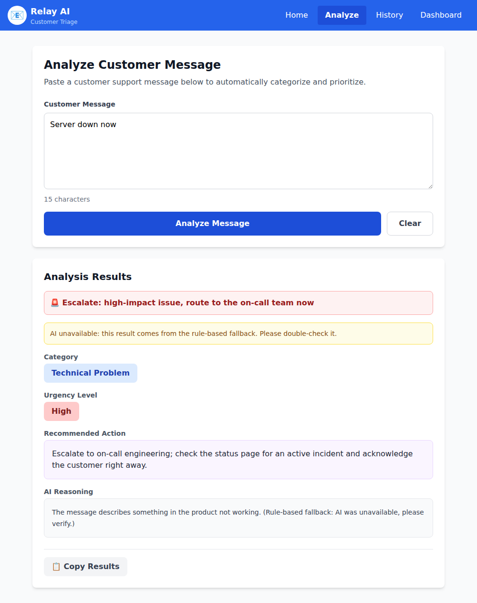

# Improvements: Customer Inbox Triage

## Testing the original app

I ran the 8 messages in `sample-messages.json` plus the README examples through the original app. The main failures:

| Message | Original result | Problem |
|---|---|---|
| "Server down now" | Low urgency | Short messages lose points, so an outage gets buried |
| "Database connection lost" | Low urgency | Same: critical issue marked Low |
| "Thank you so much! … I really appreciate …!" | High urgency | Each `!` adds points, so a thank-you note jumps the queue |
| "Hi! … really nice design! …" | High urgency | Positive feedback treated as urgent |
| "Could you add an export to CSV feature?" | "Ask user to check billing portal." | Feature requests use the billing template |
| "My payment failed and now I can't access the dashboard…" | Category changes between runs | Vague prompt, temperature 0.7, keyword-matching on free text |
| "hi" | Gets triaged | No input validation |

## Top 3 areas for improvement

1. **Urgency scoring works backwards** (`urgencyScorer.js`). Urgency came from punctuation, message length, politeness and the time of day, not from business impact. Real emergencies were marked Low and friendly notes High. For a triage product this is the most damaging failure: urgent tickets sit in the queue and SLAs are missed.
2. **AI categorization is unreliable** (`llmHelper.js`). The prompt gave the model no category list or definitions, used temperature 0.7, and the category was picked by searching the model's prose for words like "billing". A reply that mentioned billing only in passing was mislabeled, and repeated runs could disagree.
3. **Wrong actions and escalation** (`templates.js`). Feature requests were told to check the billing portal, every technical problem got "restart your browser", and escalation was decided only by whether the message was longer than 100 characters.

## What I implemented

I implemented all three, with the AI triage at the centre, because it is the change that matters most for Relay AI's value proposition: customers pay for urgent tickets to be caught and routed correctly without extra staff.

- **Structured AI triage** (`src/utils/llmHelper.js`)
  - A system prompt defines each category and each urgency level. Urgency is explicitly based on business impact, not on tone, punctuation or length.
  - The model returns JSON (`response_format: json_object`) with `category`, `urgency` and `reasoning`, at `temperature: 0` for consistent results.
  - The output is validated against the allowed values. Anything invalid falls back to rules instead of being shown to the agent.
  - Added a **Feedback** category, so thank-you notes no longer get an FAQ link.
  - The Groq client is created on first use, so a missing API key falls back to rules instead of crashing the page.
- **Deterministic rule-based fallback** (`src/utils/urgencyScorer.js`, `llmHelper.js`)
  - Used when the API is down. Urgency is based on impact keywords (outage, down, locked out, charged twice, data loss…).
  - No more random reasoning text, exclamation-mark or time-of-day penalties.
  - The UI shows a banner when a result came from the fallback, so agents know to double-check it.
- **Correct actions and escalation** (`src/utils/templates.js`)
  - Each category has its own action, with a faster path for High urgency.
  - Escalation now means High urgency on a billing or technical issue.
- **Analyze page** (`src/pages/AnalyzePage.jsx`)
  - Uses the AI's urgency and shows an escalation banner.
  - Rejects one-word inputs like "hi".

## Testing the changes

`npm test` runs `scripts/test-triage.mjs`. It checks the sample messages plus 5 new examples through the fallback path, and checks that the JSON parser accepts valid AI output and rejects invalid output:

```
PASS  Technical Problem High   ESCALATE "Database connection lost"
PASS  Feedback          Low             "Thank you so much! Your team has been incredibly helpful and"
PASS  Feature Request   Low             "Could you add an export to CSV feature? Would be really usef"
PASS  Billing Issue     High   ESCALATE "My payment failed and now I can't access the dashboard. Is t"
PASS  Technical Problem High   ESCALATE "Server down now"
PASS  Feedback          Low             "Hi! I was just browsing through your website and noticed you"
PASS  General Inquiry   Low             "What are your business hours?"
PASS  Billing Issue     High   ESCALATE "I was charged twice for my subscription this month, please r"
PASS  Technical Problem High   ESCALATE "URGENT!!! We are locked out of our account and our whole tea"
PASS  Technical Problem Medium          "Reports page is really slow today but eventually loads."
PASS  Feature Request   Low             "It would be great to have a Slack integration for new ticket"
PASS  General Inquiry   Low             "How do I add a new teammate to my workspace?"
PASS  parser: (5 valid/invalid AI responses)
PASS  feature requests no longer get the billing-portal template

All checks passed
```

"Server down now" in the running app, previously marked **Low**:



## Next steps

- Move the Groq call to a backend. The API key is currently exposed in the browser.
- Build a labelled set of real tickets and track category and urgency accuracy for each prompt change.
- Let agents correct a triage result and feed those corrections back into the evaluation set.
